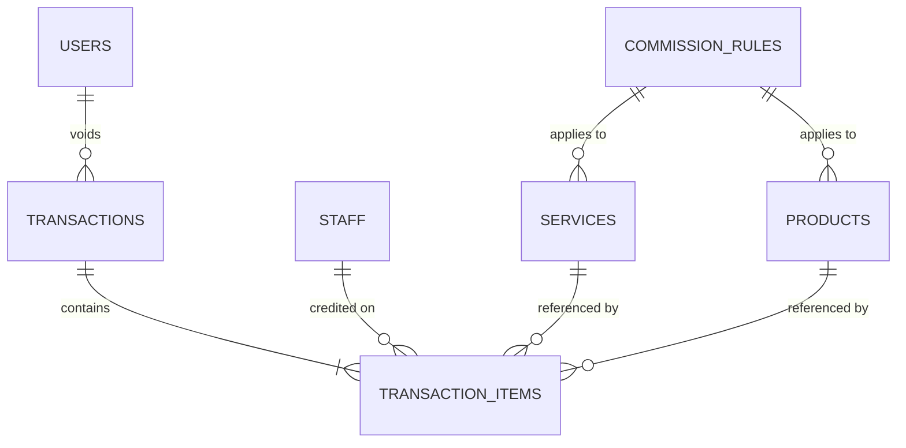

# Database Design

## Document Information

| Field | Value |
|---|---|
| Project | Salon Management System |
| Client | Yab's Hair and Beauty Studio |
| Document | Database Design |
| Version | 1.0 |
| Status | Draft |
| Author | Rafael Hidalgo |
| Date Created | August 19, 2026 |
| Last Updated | August 19, 2026 |

## Purpose

This document defines the database design for the MVP of the Salon Management System.

The database is designed to support the validated business requirements of Yab's Hair and Beauty Studio, including staff and business configuration, transaction recording, commission calculation, Cash and GCash payment tracking, historical record preservation, transaction voiding, and business reporting.

The design establishes the core data entities, relationships, historical data strategy, and integrity rules required to maintain accurate and reliable business records.

This document describes the logical database design before implementation-specific PostgreSQL schema and migration details are finalized.

## Design Principles

### Preserve Historical Truth

Completed transactions must preserve the information that was true at the time of sale.

Changes to current service prices, product prices, commission rules, staff availability, or other business configuration must not alter previously completed transaction records.

### Separate Current Configuration from Historical Records

Configuration entities such as Services, Products, Staff, and Commission Rules represent the current operational state of the business.

Transaction Items preserve historical sale information such as the actual selling price, commission rule applied, Staff Commission, and Business Share.

### Protect Financial Integrity

The database design must support the validated financial relationship:

Staff Commission + Business Share = Selling Price

Invalid financial values, contradictory transaction data, and invalid relationships should be prevented through appropriate application validation and database constraints.

### Preserve Records Instead of Destructive Deletion

Business records referenced by historical transactions should not be permanently removed when they are no longer used.

Staff members, Services, Products, and Commission Rules may instead become inactive while historical transaction relationships remain preserved.

Completed transactions shall not be directly edited or permanently deleted.

### Keep the MVP Data Model Purposeful

The database should support the validated MVP without introducing unnecessary entities or complexity for unvalidated future requirements.

For example, payment information will remain part of the Transaction entity because the MVP supports one payment method per transaction.

A separate Payments entity may be reconsidered if future requirements introduce split payments or more complex payment workflows.

### Derive Report Totals from Transaction Data

Business reporting values such as Gross Sales, Cash Sales, GCash Sales, total Staff Commission, and total Business Share should be derived from the underlying valid transaction records rather than treated as independent sources of financial truth.

Voided transactions must be excluded from active financial totals.

## Data Model Overview

The MVP database is currently designed around seven core entities.

| Entity | Purpose |
|---|---|
| Users | Stores authenticated Owner and Cashier accounts and their system roles. |
| Staff | Stores barbers and stylists who may be associated with sale items. |
| Commission Rules | Stores the current configurable commission rules used by Services and Products. |
| Services | Stores the services currently configured by the business. |
| Products | Stores products currently configured for sale. |
| Transactions | Stores transaction-level information such as date and time, payment method, status, and void information. |
| Transaction Items | Stores the individual Services or Products included within each Transaction together with their historical financial values. |

## High-Level Relationships

The current logical relationships are:

- One Transaction can contain many Transaction Items.
- One Staff member can be associated with many Transaction Items over time.
- One Service can appear in many Transaction Items over time.
- One Product can appear in many Transaction Items over time.
- One Commission Rule can be associated with many Services.
- One Commission Rule can be associated with many Products.
- One User may be associated with multiple voided Transactions as the user who performed the void.

A Transaction Item represents exactly one sold item and therefore references either one Service or one Product, but never both.

Service Transaction Items require an assigned Staff member.

Product Transaction Items may optionally reference a Staff member depending on whether a staff member is credited for the product sale.

Commission Rules
    ├── Services
    └── Products
          │
          ▼
    Transaction Items
       ▲    ▲    ▲
       │    │    │
     Staff  │    │
            │    │
      Transactions
            ▲
            │
          Users
       (voided by)

## Entity Definitions

The following sections define the logical fields and responsibilities of each core entity in the MVP database.

Database-specific data types and implementation details will be defined after the logical data model has been validated.

### Users

The Users entity represents authenticated accounts that are permitted to access the Salon Management System.

Users are separate from Staff because system users represent people authorized to access the application, while Staff represents barbers and stylists associated with sale items.

| Field | Purpose | Required | Notes |
|---|---|---|---|
| `id` | Uniquely identifies a user account | Yes | Primary key |
| `username` | Identifies the account during authentication | Yes | Must uniquely identify a user account |
| `password_hash` | Stores the securely hashed representation of the user's password | Yes | Plaintext passwords shall not be stored |
| `role` | Determines the user's system permissions | Yes | MVP roles are Owner and Cashier |
| `active` | Determines whether the account is currently permitted to access the system | Yes | Inactive accounts cannot authenticate |

### Staff

The Staff entity represents barbers and stylists who may be associated with Service and Product sale items.

Staff records do not represent system login accounts. A Staff member may exist in the database without having access to the Salon Management System.

| Field | Purpose | Required | Notes |
|---|---|---|---|
| `id` | Uniquely identifies a staff member | Yes | Primary key |
| `name` | Stores the staff member's display name | Yes | Used for transaction assignment and reporting |
| `role` | Identifies the staff member as a Barber or Stylist | Yes | Represents the staff member's operational role |
| `active` | Determines whether the staff member can be assigned to new sale items | Yes | Inactive Staff remain preserved for historical transaction references |

### Commission Rules

The Commission Rules entity represents the current configurable rules used to determine Staff Commission for Services and Products.

A Commission Rule may be referenced by multiple Services or Products.

| Field | Purpose | Required | Notes |
|---|---|---|---|
| `id` | Uniquely identifies a commission rule | Yes | Primary key |
| `name` | Provides a human-readable name for the rule | Yes | Example: Haircut Commission |
| `type` | Determines how the commission value is interpreted | Yes | Supported MVP types are Percentage and Fixed |
| `value` | Stores the staff-side commission percentage or fixed amount | Yes | Meaning depends on `type` |
| `active` | Determines whether the rule is available for current configuration | Yes | Historical transaction commission snapshots remain unchanged |

### Services

The Services entity represents the current services offered by Yab's Hair and Beauty Studio.

Service configuration may change over time without modifying historical transaction records.

| Field | Purpose | Required | Notes |
|---|---|---|---|
| `id` | Uniquely identifies a service | Yes | Primary key |
| `name` | Stores the current service name | Yes | Historical transaction items preserve the name used at the time of sale |
| `current_price` | Stores the currently configured service price | Yes | Historical selling prices are stored separately in Transaction Items |
| `allows_variable_price` | Determines whether the Cashier may enter a different final selling price | Yes | Supports services whose final price varies |
| `commission_rule_id` | Identifies the current commission rule applied to the service | Yes | Foreign key referencing Commission Rules |
| `active` | Determines whether the service is available for new transactions | Yes | Inactive Services remain available to historical references |

### Products

The Products entity represents products currently configured for sale by Yab's Hair and Beauty Studio.

Products remain separate from Services because their staff-assignment, pricing, and commission behavior differ.

| Field | Purpose | Required | Notes |
|---|---|---|---|
| `id` | Uniquely identifies a product | Yes | Primary key |
| `name` | Stores the current product name | Yes | Historical transaction items preserve the name used at the time of sale |
| `current_price` | Stores the currently configured selling price | Yes | Historical selling prices are preserved in Transaction Items |
| `commission_rule_id` | Identifies the current fixed commission rule applicable to the product | Yes | Foreign key referencing Commission Rules |
| `active` | Determines whether the product is available for new transactions | Yes | Inactive Products remain available to historical references |

### Transactions

The Transactions entity represents a completed customer sale at the transaction level.

Transaction-level information applies to the entire customer transaction rather than to individual Services or Products contained within it.

| Field | Purpose | Required | Notes |
|---|---|---|---|
| `id` | Uniquely identifies a transaction | Yes | Primary key |
| `date_time` | Records when the transaction occurred | Yes | Used for daily, monthly, and historical reporting |
| `payment_method` | Records how the transaction was paid | Yes | MVP values are Cash and GCash |
| `gcash_reference` | Stores the GCash payment reference number | Conditional | Required for GCash and absent for Cash |
| `status` | Identifies whether the transaction is active or voided | Yes | MVP statuses are Completed and Voided |
| `void_reason` | Records why the transaction was voided | Conditional | Required only when status is Voided |
| `voided_by_user_id` | Identifies the User who performed the void | Conditional | Foreign key referencing Users; required for voided transactions |
| `voided_at` | Records when the transaction was voided | Conditional | Required only when status is Voided |

### Transaction Items

The Transaction Items entity represents each individual Service or Product sold within a Transaction.

Transaction Items preserve historical financial information so that changes to current Services, Products, prices, Staff availability, or Commission Rules do not alter previously completed sales.

| Field | Purpose | Required | Notes |
|---|---|---|---|
| `id` | Uniquely identifies a transaction item | Yes | Primary key |
| `transaction_id` | Identifies the Transaction containing the item | Yes | Foreign key referencing Transactions |
| `service_id` | Identifies the originating Service | Conditional | Used for Service items; mutually exclusive with `product_id` |
| `product_id` | Identifies the originating Product | Conditional | Used for Product items; mutually exclusive with `service_id` |
| `staff_id` | Identifies the Staff member credited for the sale item | Conditional | Required for Services; optional for Products |
| `item_name_snapshot` | Preserves the item name used at the time of sale | Yes | Prevents later name changes from rewriting historical records |
| `selling_price` | Preserves the actual price charged for the item | Yes | Must remain unchanged after transaction completion |
| `commission_type_snapshot` | Preserves how commission was calculated at the time of sale | Conditional | Percentage or Fixed when commission applies |
| `commission_value_snapshot` | Preserves the percentage or fixed value used at the time of sale | Conditional | Represents the rule actually applied |
| `staff_commission` | Preserves the calculated amount awarded to Staff | Yes | Zero when a Product sale has no credited Staff member |
| `business_share` | Preserves the calculated amount attributed to the business | Yes | Selling Price minus Staff Commission |

## Data Integrity and Constraints

The database and application must prevent invalid or contradictory data from being stored.

Some rules may be enforced directly through database constraints, while others require application-level validation or authorization. The implementation strategy will be determined during technical implementation.

### Transaction Item Integrity

- Every Transaction Item shall belong to exactly one Transaction.
- Every Transaction Item shall reference exactly one Service or one Product.
- A Transaction Item shall not reference both a Service and a Product.
- A Transaction Item shall not exist without referencing either a Service or a Product.
- A Service Transaction Item shall require an assigned Staff member.
- A Product Transaction Item may optionally have an assigned Staff member.
- Referenced Staff, Services, and Products must exist.
- Inactive Staff, Services, and Products shall not be available for new Transaction Items.
- Historical Transaction Items may continue referencing records that later become inactive.
- A completed Transaction shall contain at least one Transaction Item.

### Price and Financial Integrity

- Selling Price shall be greater than zero.
- Staff Commission shall not be negative.
- Business Share shall not be negative.
- Staff Commission shall not exceed Selling Price.
- For every Transaction Item:

  `Staff Commission + Business Share = Selling Price`

- Business Share shall be calculated as:

  `Business Share = Selling Price - Staff Commission`

### Commission Integrity

- Percentage-based Commission Rules shall have a value greater than 0 and no greater than 100.
- Fixed Commission Rules shall have a value greater than 0.
- A fixed Staff Commission shall not exceed the Selling Price of the applicable Transaction Item.
- Service Transaction Items shall use the applicable configured percentage-based commission rule.
- Product Transaction Items with an assigned Staff member shall use the applicable configured fixed commission rule.
- Product Transaction Items without an assigned Staff member shall generate zero Staff Commission.
- When a Product Transaction Item has no assigned Staff member, the full Selling Price shall be treated as Business Share.
- When no Staff Commission is applied to a Product Transaction Item, commission snapshot fields shall remain empty.

### Payment Integrity

- Payment Method shall be either Cash or GCash for the MVP.
- GCash Transactions shall require a GCash reference number.
- Cash Transactions shall not contain a GCash reference number.
- The recorded payment information shall remain associated with the completed Transaction.

### Transaction Status and Voiding Integrity

- Transaction Status shall be either Completed or Voided for the MVP.
- A Completed Transaction shall not contain void information.
- A Voided Transaction shall require a Void Reason.
- A Voided Transaction shall identify the User who performed the void.
- A Voided Transaction shall record when the void occurred.
- Only an authenticated User with the Owner role shall be authorized to void a Transaction.
- Voiding shall not delete or modify the original Transaction Items or their historical financial values.
- Voided Transactions shall be excluded from active sales, payment, commission, and Business Share calculations.

### Referential and Historical Integrity

- Foreign-key relationships shall reference existing records.
- Historical Transaction Items shall remain preserved when related Staff, Services, Products, or Commission Rules are later changed or made inactive.
- Staff, Services, and Products referenced by historical Transaction Items shall not be destructively removed in a way that breaks historical relationships.
- Destructive cascading deletion shall not be used where it could remove historical financial records.
- Completed Transactions and their Transaction Items shall not be permanently deleted as part of normal application operation.

## Historical Data Strategy

The database shall distinguish between current business configuration and historical transaction facts.

### Current Configuration

The following entities represent information that may change as the business operates:

- Staff
- Services
- Products
- Commission Rules

Changes to these entities affect future business operations but shall not rewrite completed Transactions.

Examples include:

- Changing a Service's current price
- Changing a Product's current price
- Changing a Commission Rule
- Renaming a Service or Product
- Making a Staff member inactive
- Making a Service or Product inactive

### Historical Transaction Snapshots

Transaction Items shall preserve the information required to reconstruct the financial conditions of a completed sale.

Historical values include:

- Item name at the time of sale
- Actual Selling Price
- Applicable Staff assignment
- Commission type applied, when applicable
- Commission percentage or fixed value applied, when applicable
- Calculated Staff Commission
- Calculated Business Share

These values shall not be recalculated from current configuration when historical Transactions are viewed.

### Example

If a Haircut is sold for ₱200 using a 50% Staff Commission:

- Selling Price = ₱200
- Commission Type = Percentage
- Commission Value = 50%
- Staff Commission = ₱100
- Business Share = ₱100

If the current Haircut price later changes to ₱250 or the commission rule changes, the historical Transaction Item shall continue to represent the original ₱200 sale and its original commission calculation.

## Reporting and Derived Data

Financial reports shall be generated from preserved Transaction and Transaction Item data rather than relying on independently maintained report totals.

### Derived Financial Values

The following report values can be derived from active Transactions and their Transaction Items:

- Gross Sales
- Cash Sales
- GCash Sales
- Total Staff Commission
- Total Business Share
- Staff-level Sales
- Staff-level Commission
- Transaction counts

For example:

`Gross Sales = SUM(Selling Price of applicable active Transaction Items)`

`Total Staff Commission = SUM(Staff Commission of applicable active Transaction Items)`

`Total Business Share = SUM(Business Share of applicable active Transaction Items)`

Payment Method and Transaction date/time may be used to filter and group financial information for Daily and Monthly Reports.

### Voided Transactions

Transactions with a Voided status shall remain stored for historical traceability but shall not contribute to active financial reporting.

### Reporting Consistency

For applicable active report data:

`Cash Sales + GCash Sales = Gross Sales`

and:

`Total Staff Commission + Total Business Share = Gross Sales`

## Entity Relationship Diagram

The Entity Relationship Diagram (ERD) represents the logical relationships between the core entities of the MVP database.

The diagram focuses on entity relationships and cardinality. Implementation-specific PostgreSQL data types and physical schema details will be defined separately.

### Relationship Summary

| Parent Entity | Child Entity | Relationship | Foreign Key | Notes |
|---|---|---|---|---|
| Commission Rules | Services | One-to-Many | `services.commission_rule_id` | Multiple Services may use the same Commission Rule |
| Commission Rules | Products | One-to-Many | `products.commission_rule_id` | Multiple Products may use the same Commission Rule |
| Transactions | Transaction Items | One-to-Many | `transaction_items.transaction_id` | A Transaction contains one or more sale items |
| Staff | Transaction Items | One-to-Many | `transaction_items.staff_id` | Required for Services and optional for Products |
| Services | Transaction Items | One-to-Many | `transaction_items.service_id` | Used only when the Transaction Item represents a Service |
| Products | Transaction Items | One-to-Many | `transaction_items.product_id` | Used only when the Transaction Item represents a Product |
| Users | Transactions | One-to-Many | `transactions.voided_by_user_id` | Optional relationship used when a Transaction is voided |

### Logical ERD

## Physical PostgreSQL Design

This section translates the validated logical data model into PostgreSQL-oriented data types, constraints, defaults, and referential behavior.

The physical database design remains subject to validation before implementation and migration scripts are created.

### Identifier Strategy

All core MVP entities will use automatically generated integer primary keys.

This approach provides simple and stable record identifiers while remaining appropriate for the expected scale and architecture of the Salon Management System.

The identifier strategy applies to:

- Users
- Staff
- Commission Rules
- Services
- Products
- Transactions
- Transaction Items

### Staff — Physical Design

| Column | PostgreSQL Type | Nullability | Constraint / Default |
|---|---|---|---|
| `id` | `INTEGER` | NOT NULL | Primary Key, automatically generated |
| `name` | `TEXT` | NOT NULL | — |
| `role` | `TEXT` | NOT NULL | Must be `Barber` or `Stylist` |
| `active` | `BOOLEAN` | NOT NULL | Default `TRUE` |

### Users — Physical Design

| Column | PostgreSQL Type | Nullability | Constraint / Default |
|---|---|---|---|
| `id` | `INTEGER` | NOT NULL | Primary Key, automatically generated |
| `username` | `TEXT` | NOT NULL | UNIQUE |
| `password_hash` | `TEXT` | NOT NULL | Plaintext passwords are not stored |
| `role` | `TEXT` | NOT NULL | Must be `Owner` or `Cashier` |
| `active` | `BOOLEAN` | NOT NULL | Default `TRUE` |

### Commission Rules — Physical Design

| Column | PostgreSQL Type | Nullability | Constraint / Default |
|---|---|---|---|
| `id` | `INTEGER` | NOT NULL | Primary Key, automatically generated |
| `name` | `TEXT` | NOT NULL | — |
| `type` | `TEXT` | NOT NULL | Must be `Percentage` or `Fixed` |
| `value` | `NUMERIC(12,2)` | NOT NULL | Must be greater than 0; Percentage values must not exceed 100 |
| `active` | `BOOLEAN` | NOT NULL | Default `TRUE` |

### Services — Physical Design

| Column | PostgreSQL Type | Nullability | Constraint / Default |
|---|---|---|---|
| `id` | `INTEGER` | NOT NULL | Primary Key, automatically generated |
| `name` | `TEXT` | NOT NULL | — |
| `current_price` | `NUMERIC(12,2)` | NOT NULL | Must be greater than 0 |
| `allows_variable_price` | `BOOLEAN` | NOT NULL | Default `FALSE` |
| `commission_rule_id` | `INTEGER` | NOT NULL | Foreign Key referencing `commission_rules.id` |
| `active` | `BOOLEAN` | NOT NULL | Default `TRUE` |

### Products — Physical Design

| Column | PostgreSQL Type | Nullability | Constraint / Default |
|---|---|---|---|
| `id` | `INTEGER` | NOT NULL | Primary Key, automatically generated |
| `name` | `TEXT` | NOT NULL | — |
| `current_price` | `NUMERIC(12,2)` | NOT NULL | Must be greater than 0 |
| `commission_rule_id` | `INTEGER` | NOT NULL | Foreign Key referencing `commission_rules.id` |
| `active` | `BOOLEAN` | NOT NULL | Default `TRUE` |

### Transactions — Physical Design

| Column | PostgreSQL Type | Nullability | Constraint / Default |
|---|---|---|---|
| `id` | `INTEGER` | NOT NULL | Primary Key, automatically generated |
| `date_time` | `TIMESTAMPTZ` | NOT NULL | Automatically records transaction time |
| `payment_method` | `TEXT` | NOT NULL | Must be `Cash` or `GCash` |
| `gcash_reference` | `TEXT` | Conditional | Required for GCash; must be empty for Cash |
| `status` | `TEXT` | NOT NULL | Must be `Completed` or `Voided`; default `Completed` |
| `void_reason` | `TEXT` | Conditional | Required only when Voided |
| `voided_by_user_id` | `INTEGER` | Conditional | Foreign Key referencing `users.id`; required only when Voided |
| `voided_at` | `TIMESTAMPTZ` | Conditional | Required only when Voided |

### Transaction Items — Physical Design

| Column | PostgreSQL Type | Nullability | Constraint / Default |
|---|---|---|---|
| `id` | `INTEGER` | NOT NULL | Primary Key, automatically generated |
| `transaction_id` | `INTEGER` | NOT NULL | Foreign Key referencing `transactions.id` |
| `service_id` | `INTEGER` | Conditional | Foreign Key referencing `services.id`; mutually exclusive with `product_id` |
| `product_id` | `INTEGER` | Conditional | Foreign Key referencing `products.id`; mutually exclusive with `service_id` |
| `staff_id` | `INTEGER` | Conditional | Foreign Key referencing `staff.id`; required for Services and optional for Products |
| `item_name_snapshot` | `TEXT` | NOT NULL | Historical item name |
| `selling_price` | `NUMERIC(12,2)` | NOT NULL | Must be greater than 0 |
| `commission_type_snapshot` | `TEXT` | Conditional | Must be `Percentage` or `Fixed` when commission applies |
| `commission_value_snapshot` | `NUMERIC(12,2)` | Conditional | Must be greater than 0 when commission applies |
| `staff_commission` | `NUMERIC(12,2)` | NOT NULL | Must be greater than or equal to 0 |
| `business_share` | `NUMERIC(12,2)` | NOT NULL | Must be greater than or equal to 0 |